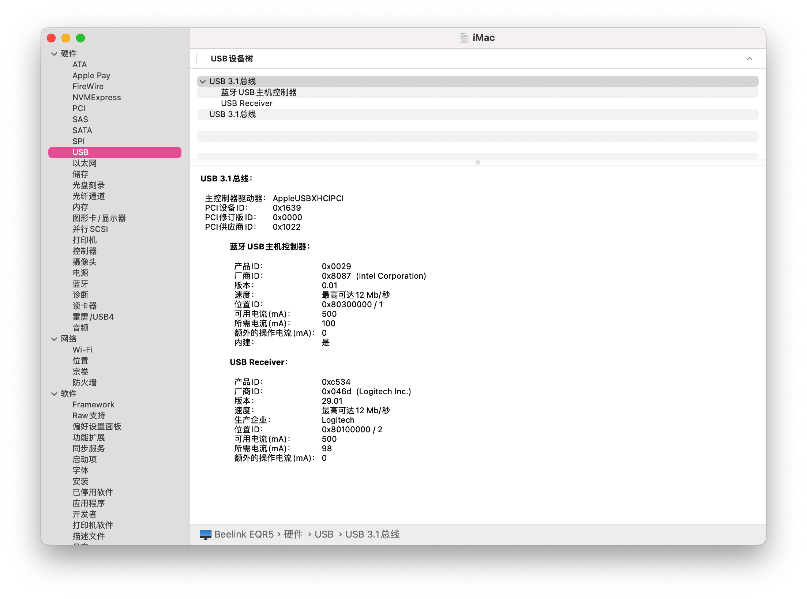
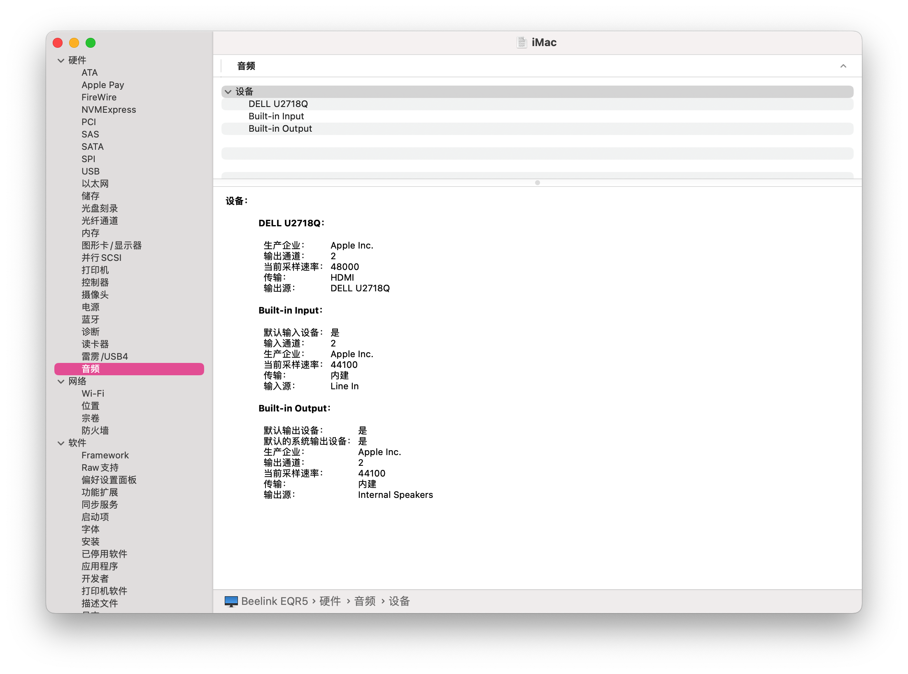

# Beelink-EQR5-Hackintosh
> Beelink EQR5 Hackintosh

## 电脑配置

|    规格    |                           详细信息                           |
| :--------: | :----------------------------------------------------------: |
|  电脑型号  |                         Beelink EQR5                         |
|  操作系统  | macOS `Sequoia` / `Sonoma` / `Ventura` /  `Monterey` / `Big Sur` / `Catalina` |
|   处理器   |                 AMD 锐龙 R7-5825U 8核16线程                  |
|    内存    |                      16 GB DDR4 3200MHz                      |
|   硬盘1    |                      CT500P3PSSD8 500GB                      |
|   硬盘2    |              M.2 PCI-e 3.0 x4 NVMe,最高支持 4TB              |
|    核显    |      Radeon Vega Graphics 显存建议设置为：3GB/4GB       |
|   显示器   |                              无                              |
|    声卡    |                            ALC897                            |
|  无线网卡  |            m.2 NGFF插槽，默认出厂为 `Intel AX200`            |
| 有线网卡1  |     Realtek RTL8168H/8111H PCI Express Gigabit Ethernet      |
| 有线网卡 2 |     Realtek RTL8168H/8111H PCI Express Gigabit Ethernet      |

## 更新日志

- 11-5-5024
  - 第一次提交
  

## 截图

